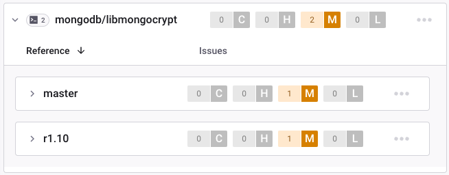

# Releasing libmongocrypt

These steps describe releasing the libmongocrypt C library (not the language bindings).

## Version number scheme ##
Version numbers of libmongocrypt must follow the format 1.[0-9].[0-9] for releases and 1.[0-9].[0-9]-(alpha|beta|rc)[0-9] for pre-releases.  This ensures that Linux distribution packages built from each commit are published to the correct location.

## Steps to release ##

### Check for Vulnerabilities

Snyk and Silk are used to satisfy vulnerability scanning requirements of [DRIVERS-714](https://jira.mongodb.org/browse/DRIVERS-714). Prior to releasing, ensure necessary reported vulnerabilities meet requirements described in: [MongoDB Software Security Development Lifecycle Policy](https://docs.google.com/document/d/1u0m4Kj2Ny30zU74KoEFCN4L6D_FbEYCaJ3CQdCYXTMc/edit?tab=t.0#bookmark=id.l09k96qt24jm).

#### Check Snyk

Go to [Snyk](https://app.snyk.io/) and select the `dev-prod` organization. If access is needed, see [Snyk Onboarding](https://docs.google.com/document/d/1A38HvDvVFOwLtJQfQwIGcy5amAIpDwHUkNInwezLwXY/edit#heading=h.9ayipd2nt7xg). Check the CLI target named `mongodb/libmongocrypt`. The CLI targets may be identified by this icon: . There are reference targets for each tracked branch:



##### Update Snyk

Update the Snyk reference target tracking the to-be-released branch. For a patch release (e.g. x.y.z), check-out the `rx.y` branch and update the `rx.y` reference target. For a minor release (e.g. x.y.0), check out the `master` branch update the `master` reference target.

Run `cmake` to ensure generated source files are present:
```bash
cmake -S. -Bcmake-build -D BUILD_TESTING=OFF
cmake --build cmake-build --target mongocrypt
```

Print dependencies found by Snyk and verify libbson is found:
```bash
snyk test --unmanaged --print-dep-paths
```

Copy the organization ID from [Snyk settings](https://app.snyk.io/org/dev-prod/manage/settings). Create the new Snyk reference target to track the newly created release branch:
```bash
snyk auth
snyk monitor \
--org=$ORGANIZATION_ID \
--target-reference="<rx.y or master>" \
--unmanaged \
--remote-repo-url=https://github.com/mongodb/libmongocrypt.git
```

Check the updated reference targets in Snyk for detected vulnerabilities.

#### Check the Augmented SBOM

Examine the Augmented SBOM from a recent execution of the `sbom` task in an Evergreen patch or commit build.

Evergreen CLI may be used to schedule only the `sbom` task:

```bash
# Ensure `-p` matches the correct Evergreen project for the current branch!
evergreen patch -y -p libmongocrypt -t all -v sbom -f
```

Check the contents of the "vulnerabilities" field (if present) in the Augmented SBOM.

### Release

Do the following when releasing:
- If this is a feature release (e.g. `x.y.0` or `x.0.0`), follow these steps: [Creating SSDLC static analysis reports](https://docs.google.com/document/d/1rkFL8ymbkc0k8Apky9w5pTPbvKRm68wj17mPJt2_0yo/edit).
- Check out the release branch. For a release `x.y.z`, the release branch is `rx.y`. If this is a new minor release (`x.y.0`), create the release branch.
- Update CHANGELOG.md with the version being released.
- Ensure `etc/purls.txt` is up-to-date.
- Update `etc/third_party_vulnerabilities.md` with any updates to new or known vulnerabilities for third party dependencies that must be reported.
- If this is a new minor release (e.g. `x.y.0`):
   - Update the Linux distribution package installation instructions in [README.md](../README.md) to refer to the new version `x.y`.
   - Update the [libmongocrypt-release](https://spruce.mongodb.com/project/libmongocrypt-release/settings/general) Evergreen project (requires auth) to set `Branch Name` to `rx.y`.
- Commit the changes on the `rx.y` branch with a message like "Update CHANGELOG.md for x.y.z".
- Tag the commit with `git tag -a <tag>`.
   - Push both the branch ref and tag ref in the same command: `git push origin master 1.8.0-alpha0` or `git push origin r1.8 1.8.4`
   - Pushing the branch ref and the tag ref in the same command eliminates the possibility of a race condition in Evergreen (for building resources based on the presence of a release tag)
   - Note that in the future (e.g., if we move to a PR-based workflow for releases, or if we simply want to take better advantage of advanced Evergreen features), it is possible to use Evergreen's "Trigger Versions With Git Tags" feature by updating both `config.yml` and the project's settings in Evergreen
- Ensure the version on Evergreen with the tagged commit is scheduled. The following tasks must pass to complete the release:
   - `upload-all`
   - `windows-upload-release`
   - All `publish-packages` tasks.
      - If the `publish-packages` tasks fail with an error like `[curator] 2024/01/02 13:56:17 [p=emergency]: problem submitting repobuilder job: 404 (Not Found)`, this suggests the published path does not yet exist. Barque (the Linux package publishing service) has protection to avoid unintentional publishes. File a DEVPROD ticket ([example](https://jira.mongodb.org/browse/DEVPROD-4053)) and assign to the team called Release Infrastructure to request the path be created. Then re-run the failing `publish-packages` task. Ask in the slack channel `#devprod-release-tools` for further help with `Barque` or `curator`.
- Create the release from the GitHub releases page from the new tag.
   - Attach the tarball and signature file from the Files tab of the `windows-upload-release` task. [Example](https://github.com/mongodb/libmongocrypt/releases/tag/1.10.0).
   - Attach the Augmented SBOM file to the release as `cyclonedx.augmented.sbom.json`.
     Download the Augmented SBOM from a recent execution of the `sbom` task in an Evergreen patch or commit build.
   - Attach `etc/third_party_vulnerabilities.md` to the release.
   - Attach `etc/ssdlc_compliance_report.md` to the release.

- If this is a new minor release (e.g. `x.y.0`):
   - File a DOCSP ticket to update the installation instructions on [Install libmongocrypt](https://www.mongodb.com/docs/manual/core/csfle/reference/libmongocrypt/). ([Example](https://jira.mongodb.org/browse/DOCSP-36863))
   - Generate a new unique SBOM serial number for the next release:
     ```bash
     ./.evergreen/earthly.sh +sbom-generate-new-serial-number
     ```
   - Create a new Snyk reference target. The following instructions use the example branch `rx.y`:

     Run `cmake` to ensure generated source files are present:
     ```bash
     cmake -S. -Bcmake-build -D BUILD_TESTING=OFF
     cmake --build cmake-build --target mongocrypt
     ```

     Print dependencies found by Snyk and verify libbson is found:
     ```bash
     snyk test --unmanaged --print-dep-paths
     ```

     Copy the organization ID from [Snyk settings](https://app.snyk.io/org/dev-prod/manage/settings). Create the new Snyk reference target to track the newly created release branch:
     ```bash
     snyk auth
     snyk monitor \
      --org=$ORGANIZATION_ID \
      --target-reference=rx.y \
      --unmanaged \
      --remote-repo-url=https://github.com/mongodb/libmongocrypt.git
     ```
     Snyk reference targets for older release branches may be removed if no further releases are expected on the branch.
   - Update the [Github Webhook](https://wiki.corp.mongodb.com/display/INTX/Githook) to include the new branch.
     - Navigate to the [Webhook Settings](https://github.com/mongodb/libmongocrypt/settings/hooks).
     - Click `Edit` on the hook for `https://githook.mongodb.com/`.
     - Add the new release branch to the `Payload URL`. Remove unmaintained release branches.
- Make a PR to apply the "Update CHANGELOG.md for x.y.z" commit to the `master` branch.
- Update the release on the [Jira releases page](https://jira.mongodb.org/projects/MONGOCRYPT/versions).
- Record the release on [C/C++ Release Info](https://docs.google.com/spreadsheets/d/1yHfGmDnbA5-Qt8FX4tKWC5xk9AhzYZx1SKF4AD36ecY/edit?usp=sharing). This is done to meet SSDLC reporting requirements.
- Add a link to the Evergreen waterfall for the tagged commit to [libmongocrypt Security Testing Summary](https://docs.google.com/document/d/1dc7uvBzu3okAIsA8LSW5sVQGkYIvwpBVdg5v4wb4c4s/edit#heading=h.5t79jwe4p0ss).

## Homebrew steps ##
Submit a PR to update the Homebrew package https://github.com/mongodb/homebrew-brew/blob/master/Formula/libmongocrypt.rb. ([Example](https://github.com/mongodb/homebrew-brew/pull/208)). If not on macOS, request a team member to do this step.

## Debian steps ##
If you are not a Debian maintainer on the team, request a team member to do the steps in this section.

Refer to the [Debian](https://github.com/mongodb/mongo-c-driver/blob/master/docs/dev/debian.rst) steps.

For a minor release (e.g. x.y.0), submit a merge request to the [extrepo-data](https://salsa.debian.org/extrepo-team/extrepo-data) project in Debian to update the PPA. The change would look something like this:

```
diff --git a/repos/debian/libmongocrypt.yaml b/repos/debian/libmongocrypt.yaml
index 609dc0b..f7530a9 100644
--- a/repos/debian/libmongocrypt.yaml
+++ b/repos/debian/libmongocrypt.yaml
@@ -4,7 +4,7 @@ libmongocrypt:
   source:
     Types: deb
     URIs: https://libmongocrypt.s3.amazonaws.com/apt/debian
-    Suites: <SUITE>/libmongocrypt/1.11
+    Suites: <SUITE>/libmongocrypt/1.12
     Components: main
     Architectures: amd64 arm64
   suites:
```
